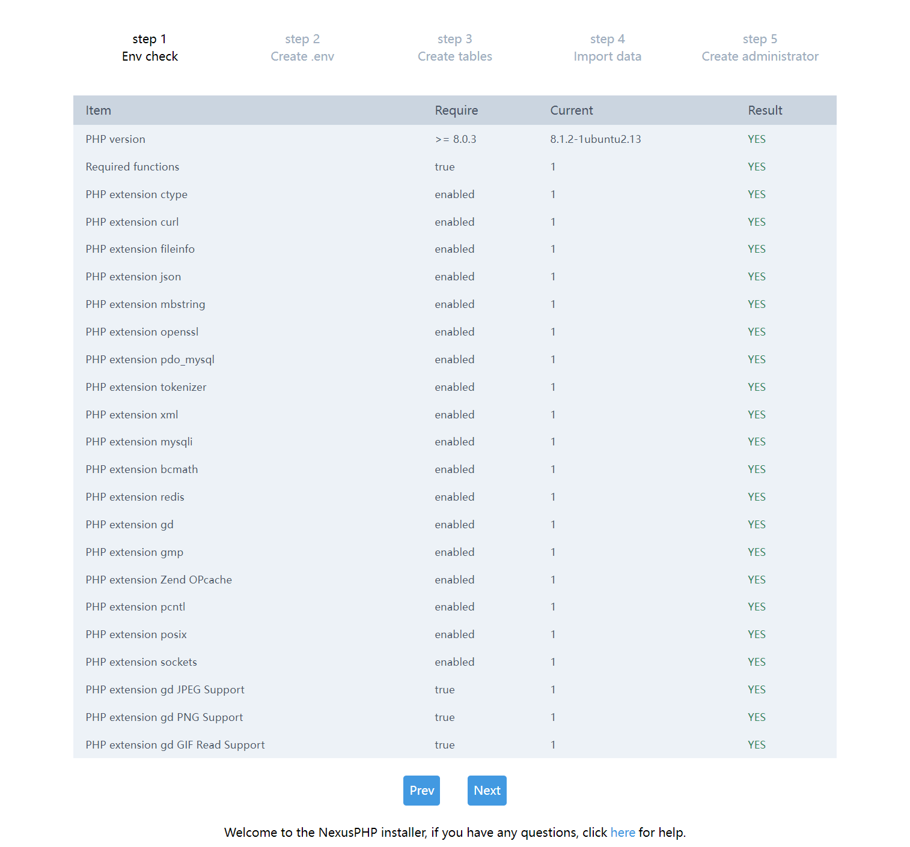
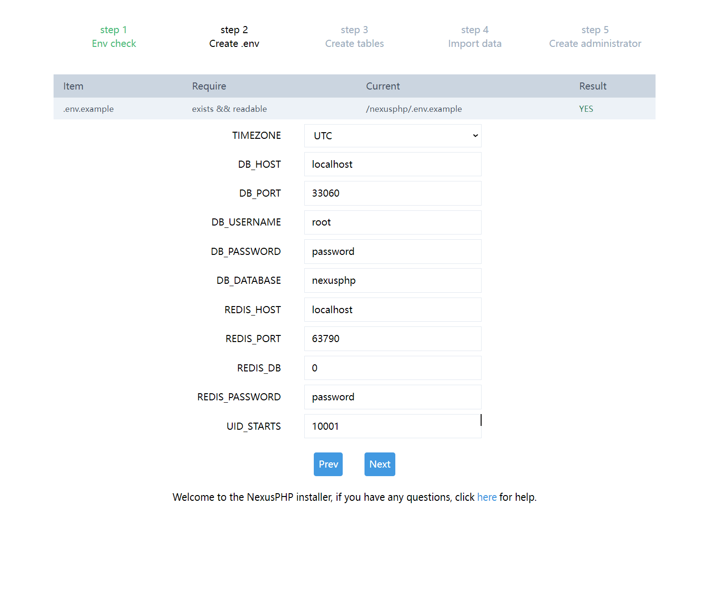
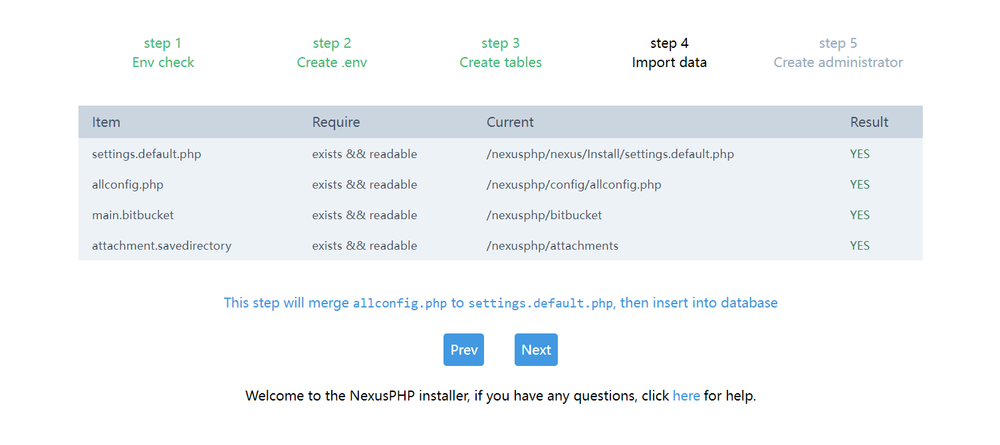
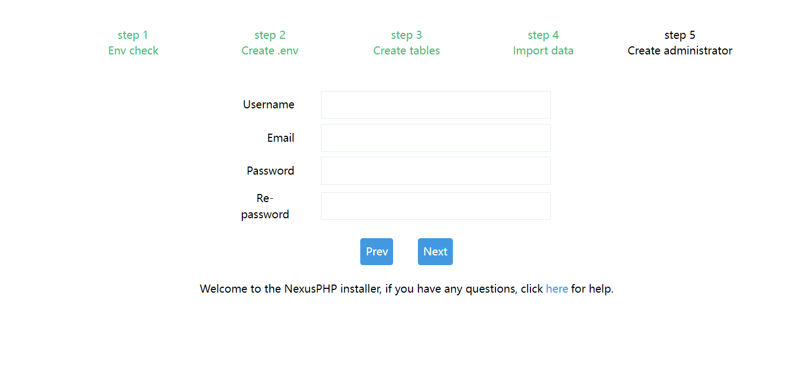

# Nexusphp on Docker

> php8.1  

* 使用 docker compose 对 Nexusphp 环境进行统一管理。简化部署，迁移操作。

> 如果有帮助的话，不妨点个 Star 吧~  

## 数据备份（~~一键跑路~~）

1. fork 并 clone 本项目
2. 删除所有 .gitignore 文件：`find /nexusphp -type f -name ".gitignore" -delete`
3. 正常安装
4. 将所有变更 commit 并 push
5. 添加定时任务，比如一小时：将所有变更定时 commit 并 push
6. 假设现在机器被收回了。。。
7. 只需要 git clone xx && docker-compose up -d 满血复活
8. 修改定时任务，添加 supervisor 任务，如 [队列守护进程(>=1.8需要)](#魔力不会增加)

* 默认情况下 compose 文件已经将 MySQL，Redis 的数据映射出来了。然后 nexusphp 的 .env 手动保存下差不多就可以了.

## 启动

1. 构建镜像
2. clone 站点源码：`git submodule init && git submodule update`
3. 切换需要的分支，比如：`v1.8.4`
4. 修改 `docker-compose.yml` 里面 `password` 相关字段。都是密码相关的，注意安全...
5. 按需修改 `nginx/sites-enabled/nexusphp.conf`
6. 启动容器：`docker-compose up -d`
7. 进入 nginx 容器: `docker exec -it nginx bash`
8. 安装依赖: `composer install`
9. 安装之前需要手动创建数据库，执行 `docker exec -it mysql bash`
10. 登录数据库：`mysql -uroot -p`，密码无回显

```mysql
# https://doc.nexusphp.org/installation.html#%E5%88%9B%E5%BB%BA%E6%95%B0%E6%8D%AE%E5%BA%93
create database `nexusphp` default charset=utf8mb4 collate utf8mb4_general_ci;
```
11. 打开 `http://localhost:8080/`, 正常情况下自动跳转到 `http://localhost:8080/install/install.php`
12. 从界面可以看出安装一共5步。检查环境, 创建 .env, 创建 MySQL 表, 导入数据, 建立管理员账户
13. 第一步，直接下一步。
14. 第二步，按需填入相关配置。最后会保存在 `nexusphp/.env`. 这里可能会有权限问题。 因为 php 默认是以 www-data 用户运行而非 root。映射的文件大概率没有权限。可以在容器内选择一下做法其中一种.
    * `touch .env` 然后再修改权限
    * `chmod -R 777 /nexusphp`
    * 备份原目录，chmod 777，安装完成后 cp .env 文件，恢复目录
15. 第三步，直接下一步。
16. 第四步，直接下一步。
17. 第五步按需填写，完成。至此 `nexusphp` 已经安装完成，打开 `http://localhost:8080/` 登录即可。
18. 可以的话，可以考虑删除 install 目录，`rm -rf nexusphp/public/install`。
19. 修改定时任务，添加 supervisor 任务，如 [队列守护进程(>=1.8需要)](#魔力不会增加)






## 构建

```
docker-compose build
```

### 构建并启动

```
docker-compose up -d --build && docker exec -it nginx bash
# 重定向镜像构建日志至 1.log
# docker-compose up -d --build >./1.log 2>&1 && docker exec -it nginx bash
```

## FAQ

### 魔力不会增加

* 创建队列守护进程(>=1.8需要)
* https://doc.nexusphp.org/installation.html#%E5%88%9B%E5%BB%BA%E9%98%9F%E5%88%97%E5%AE%88%E6%8A%A4%E8%BF%9B%E7%A8%8B-1-8%E9%9C%80%E8%A6%81

## 参见

* https://doc.nexusphp.org/